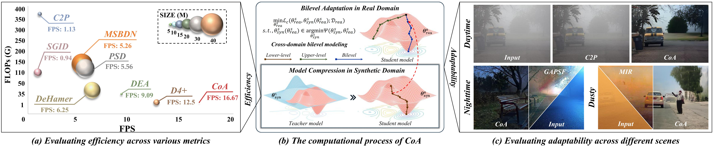
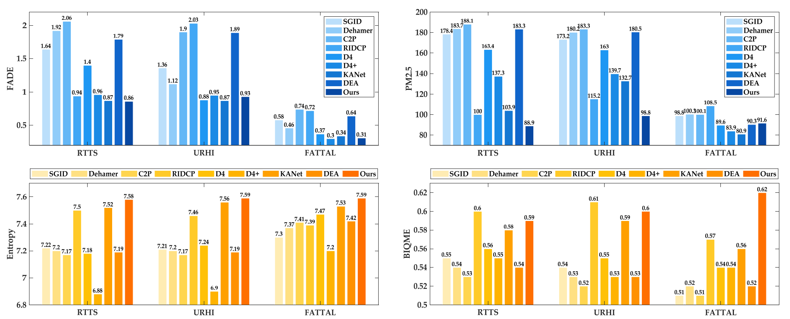

<div align="center"> 

<h2> 
CoA: Towards Real Image Dehazing via Compression-and-Adaptation

(CVPR 2025)
</h2>

Long Ma, Yuxin Feng, Yan Zhang, Jinyuan Liu, Weimin Wang, Guangyong Chen, Chengpei Xu, Zhuo Su

</div>

## Model



## Results



## Getting Started

### Environment

Step 1. Clone this repo:

```
git clone https://github.com/YanZhang-zy/CoA.git
cd CoA/
```

Step 2. Create a new conda environment and install dependencies:

```
conda create -n CoA python=3.10
conda activate CoA
conda install pytorch==2.2.0 torchvision==0.17.0 torchaudio==2.2.0 pytorch-cuda=11.8 -c pytorch -c nvidia
pip install -r requirements.txt
```

### Data Preparation

1. Download the haze dataset from websites or papers.
2. Make sure the file structure is consistent with the following:

```
dataset/
├── HAZE4K
│   ├── test
│   |   ├── clear
│   |   │   ├── 1.png
│   |   │   └── 2.png
│   |   │   └── ...
│   |   └── hazy
│   |       ├── 1_0.89_1.56.png
│   |       └── 2_0.93_1.66.png
│   |       └── ...
│   └── train
│       ├── clear
│       │   ├── 1.png
│       │   └── 2.png
│       │   └── ...
│       └── hazy
│           ├── 1_0.68_0.66.png
│           └── 2_0.59_1.95.png
│           └── ...
├── OTS
│   ├── test
│   |   ├── clear
│   |   │   ├── 1400.png
│   |   │   └── 1401.png
│   |   │   └── ...
│   |   └── hazy
│   |       ├── 1400_1.png
│   |       └── ...
│   |       └── 1400_10.png
│   |       └── 1401_1.png
│   |       └── ...
│   └── train
│       ├── clear
│       │   ├── 1.png
│       │   └── 2.png
│       │   └── ...
│       └── hazy
│           ├── 1_1_0.90179.png
│           └── ...
│           └── 1_10_0.98796.png
│           └── 2_1_0.99082.png
│           └── ...
├── REAL_FOGGY
│   ├── 1.png
│   └── 2.png
│   └── 3.png
│   └── ...
```

The datasets can be downloaded at
+ RESIDE: https://sites.google.com/view/reside-dehaze-datasets/reside-v0
+ HAZE4K: https://pan.baidu.com/s/19stkJ3aaF8WgHK2FBytnZA?pwd=0411
+ REAL_FOGGY: https://pan.baidu.com/s/1GS9qkwcBcKB411pdSwFcDg?pwd=0519

### Training

1. Run the following script to train CoA from scratch:


## Acknowledgments
We would like to extend our gratitude to the following implementations for their contributions to the development of CoA:

- [CLIP-LIT](https://github.com/ZhexinLiang/CLIP-LIT.git) for providing the methodology for training pre-trained prompt pairs.
- [DEA-Net](https://github.com/cecret3350/DEA-Net.git) for providing the re-parameterization technique.

## Citation
If you find our paper and repo are helpful for your research, please consider citing:

```bibtex
@inproceedings{ma2025coa,
 author={Long Ma, Yuxin Feng, Yan Zhang, Jinyuan Liu, Weimin Wang, Guangyong Chen, Chengpei Xu, Zhuo Su},
 booktitle={Proceedings of the IEEE/CVF Conference on Computer Vision and Pattern Recognition (CVPR)},
 title={CoA: Towards Real Image Dehazing via Compression-and-Adaptation},
 year={2025}
}
```

## Contacts :mailbox_with_mail:
If you have any questions or suggestions about this repo, please feel free to contact me (malone94319@gmail.com).

